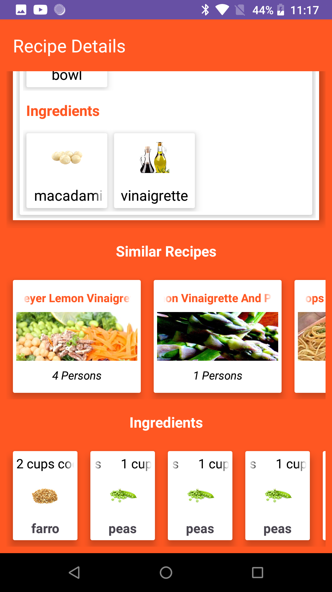

# RecipeApp

A Recipe App built using Android Studio, where you can discover and explore a variety of delicious recipes.

## Features

- Browse through a collection of recipes.
- Search for specific recipes by name, ingredients, or cuisine.
- View detailed recipe instructions, ingredients, and cooking tips.
- Save your favorite recipes for quick access.
- Share recipes with friends and family.

 ## Technologies Used

- Android (Java/Kotlin)
- Retrofit for fetching word from a REST API.
- Android Studio

## Screenshots

 
 
 
 
 
 

## License

For any questions or feedback, you can reach out to me diptiparida1999@gmail.com.

   git clone https://github.com/YourUsername/RecipeApp.git
